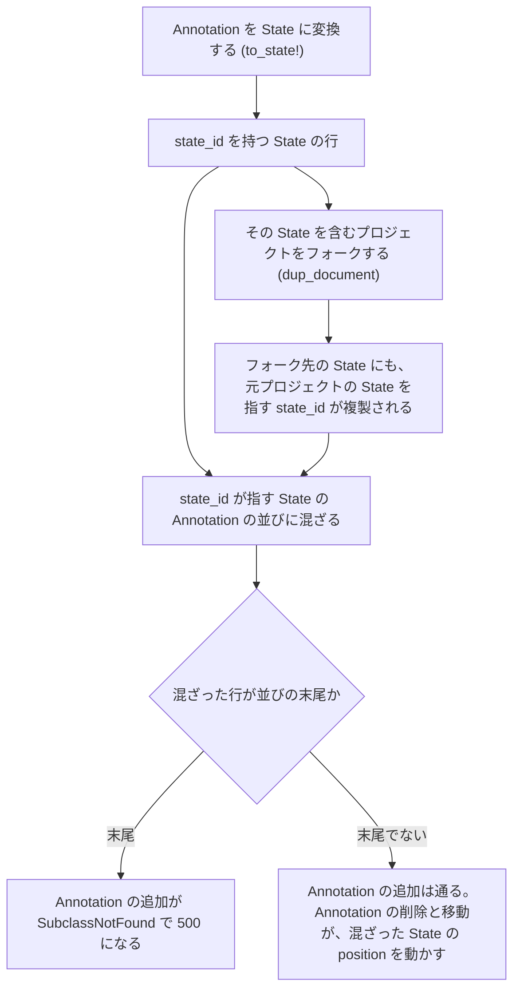

# ChangeSpec: 変換とフォークで State に残る state_id の解消

## 変更の目的

Annotation を State に変換すると、変換後の State に `state_id` が残る。Annotation の並び（acts_as_list）は `state_id` だけで行を引くため、この State が元の親 State の Annotation の並びに混ざり、並びの末尾にあると Annotation の追加が `ActiveRecord::SubclassNotFound` で 500 になる（Sentry: FABBLE-3N）。本番では 139 個の State がこの状態にある。`state_id` が State に残る経路のうち、変換（`to_state!`）とフォークの 2 つを塞ぎ、既存の行を補正する。

## 現状

`state_id` を持つ State の行は、本番では次の経路で生じ、Annotation の並びに混ざっている。並びの末尾かどうかで結果が分かれる。

変換先の `position` はプロジェクトの State の `position` の最大値 + 1 である。この値が親に残る Annotation の `position` の最大値を上回ると、変換の直後から混ざった行が末尾になる。ローカルの実測では、State 4 個・Annotation 3 個のプロジェクトで 1 件を変換すると、同じ親への次の追加が 500 になった。

本番の調査（2026-09-21、読み取り専用）の結果は次のとおり。

| 項目 | 結果 |
|------|------|
| Annotation 以外で `state_id` を持つ行 | 393 件。すべて `Card::State`。`state_id` を持つ Annotation は 31,224 件 |
| 参照先が同じプロジェクトの State | 238 件。うち 219 件は `created_at` と `updated_at` が揃わず、既存の行を更新する現行の `to_state!` の形に一致する。揃う 19 件のうち 18 件は `created_at` が 2017-04 から 2018-10 で、行を複製して作る旧実装の `to_state!`（本番系の master には 2018-11-10 のマージ c0c80b3e まで残っていた）の形に一致する。残る 1 件（id 51114、2021-11）は個別に確認し、不審な点はなかった |
| 参照先が別プロジェクトの State | 57 件。57 件すべてで、行のプロジェクトが参照先のプロジェクトのフォークの系列にある |
| 参照先のレコードなし | 92 件。フォークではないプロジェクトに 49 件、フォークで作られたプロジェクトに 43 件 |
| 参照先が Annotation | 6 件。参照先の State が後から Annotation に変換された形である（経路はデータで確かめていない） |
| 混ざった行のある並び | 242。うち参照先の State が存在する並びは 190 |
| Annotation の追加が 500 になる State | 190 のうち 139 個（119 プロジェクト）。うち 7 個は末尾の `position` が Annotation と同値で、結果が DB の返す順に依存する。23 個は別プロジェクトの行が混ざっている |
| 追加が通る State | 190 のうち 51 個 |
| 混ざった行の `updated_at` | 2017 年から 2026 年まで毎年ある。2026 年は 15 件。`updated_at` は並びの操作でも進むため、変換の時期ではなく、その上限の目安である |
| State の `position` の重複 | 混ざった行を持つプロジェクト 236 のうち 8。State を持つ全プロジェクト 3,783 のうち 32 |
| Sentry のイベントの State（id 59553） | 並びにあるのは `Card::State`（id 59554、`position` 10）の 1 行だけで、Annotation は 0 件 |

コードの現状は次のとおり。

- `Card::Annotation#to_state!` は `type`・`project_id`・`position` を更新し、`states_count` を 1 増やす（[app/models/card/annotation.rb:58-69](../../app/models/card/annotation.rb#L58-L69)）。`state_id` は消さない。State の `state_id` を読むコードは `app` と `lib` になく、`to_state!` の履歴（2016-12 の最初の実装から、行を複製して保存する形で親の参照ごと複製していた）にも、テストにも、`state_id` を残す意図の記述はない。リポジトリの外に State の `state_id` を読む利用者がいないことは、ユーザーに確認した。変換先の `position` が親の Annotation の `position` と同値になる配置では、acts_as_list が親の並びの間の行を 1 ずつ詰める（ローカルの実測で、State 3 個・Annotation 4 件の `position` 2 を変換すると、残りの Annotation が 3→2、4→3 になった）。
- `Card::Annotation` の acts_as_list は `state_id` を scope にする（[annotation.rb:35](../../app/models/card/annotation.rb#L35)）。acts_as_list 0.9.19（Gemfile.lock で固定）は並びを引くときに `unscope(:select, :where)` で STI の `type` 条件ごと外すため、並びは `cards` のうち `state_id` が一致するすべての行になる。追加時は並びの末尾の行を `Card::Annotation` として読み込むので、末尾が `Card::State` だと `SubclassNotFound` になる。
- 並びの操作（追加時の末尾の取得、削除と移動に伴う `position` の増減）は同じ並びを対象にし、`position` と同時に `updated_at` も書き換える。ローカルの実測で、Annotation を 1 件削除すると、混ざった State の `position` が 5 から 4 になり、同じプロジェクトの State に `position` 4 の重複ができた。
- `Card::Annotation` は `belongs_to :state` を必須にするため、検証を通る保存では `state_id` を NULL にできない。ローカルの実測で、`update!` の前に列単位の更新で NULL にした場合、`update!` の中で同時に NULL にした場合、`update!` の後に `update!` で NULL にした場合のいずれも、`State must exist` の検証の例外で失敗した。検証だけを飛ばして保存すると、scope の変更として扱われ、`state_id` が NULL のカード全体（全プロジェクトの State）の `position` が動く（[annotation.rb:31-34](../../app/models/card/annotation.rb#L31-L34) のコメント。ローカルの実測で、別プロジェクトの State の `position` が 2・3・4 から 3・4・5 になった）。ローカルの実測では、`update!` の後に列単位の更新で NULL にした場合、変換後の `position` と `states_count` は現行と同じで、`position` が変わったのは変換した行だけだった（変換先の `position` が親の Annotation と衝突しない配置での実測）。
- `Project#fork_for!` は State を `dup_document` で複製する（[app/models/project.rb:113-135](../../app/models/project.rb#L113-L135)）。`Card#dup_document` は `dup` で主キーとタイムスタンプを除く属性を複製し（[app/models/card.rb:57-64](../../app/models/card.rb#L57-L64)）、`Card::State#dup_document` は Annotation を複製して付け替える（[app/models/card/state.rb:68-72](../../app/models/card/state.rb#L68-L72)）。State 自身の `state_id` はそのまま複製される。ローカルの実測で、フォーク先の State が元プロジェクトの State を指す `state_id` を持った。
- `Card::State` の `has_many :annotations, dependent: :destroy` は `type` 条件付きなので、親 State を削除しても変換済みの行は残る（[state.rb:38-42](../../app/models/card/state.rb#L38-L42)）。ローカルの実測で、親の削除後に `state_id` を持つ State が残った。
- `Card::State#to_annotation!` は `Card::State` のインスタンスに `type` と `state_id` を設定して保存する（[state.rb:57-66](../../app/models/card/state.rb#L57-L66)）。
- `Card.updatable_columns` は `type` を許可する（[card.rb:71-76](../../app/models/card.rb#L71-L76)）。Annotation の更新の要求に `type` を `Card::State` として含めると、`state_id` を持ったまま `Card::State` になる行ができる。ローカルの実測で、`type` が `Card::State`、`state_id` が元の親、`project_id` が NULL の行になった。本番の混ざった行のうち、参照先が State の 295 件はすべて同じプロジェクトかフォークの系列に分類されており、`project_id` が NULL の行を含まない。
- `CardComment.for_project` は、`project_id` が一致するカードと、`state_id` がそのプロジェクトの State を指すカードのコメントを返す（[app/models/card_comment.rb:33-37](../../app/models/card_comment.rb#L33-L37)）。管理画面のカードコメント一覧の絞り込みと、プロジェクト単位のコメントのスパム一括認定が使う。別プロジェクトの State を指す混ざった行のコメントは、参照先のプロジェクトの絞り込みにも含まれる。該当するコメントの件数は調べていない。
- `#to_state!` の既存テストは、Annotation の親 State と変換先のプロジェクトを別々の factory で作る（[spec/models/card/annotation_spec.rb:120-138](../../spec/models/card/annotation_spec.rb#L120-L138)）。本番の形（同じプロジェクト内の変換）ではなく、`state_id` も検証しない。フォーク（[spec/models/project_spec.rb:99](../../spec/models/project_spec.rb#L99)）と `dup_document`（[spec/models/card/state_spec.rb:69](../../spec/models/card/state_spec.rb#L69)）のテストも `state_id` を検証しない。

### 関連ファイル

| ファイル | 役割 |
|---------|------|
| [app/models/card/annotation.rb](../../app/models/card/annotation.rb) | `to_state!`。Annotation から State への変換 |
| [app/models/card/state.rb](../../app/models/card/state.rb) | `dup_document`。フォーク時の State の複製 |
| [app/models/card.rb](../../app/models/card.rb) | `dup_document`。属性の複製 |
| [app/models/project.rb](../../app/models/project.rb) | `fork_for!`。プロジェクトのフォーク |
| [app/controllers/annotations_controller.rb](../../app/controllers/annotations_controller.rb) | `to_state` アクション。変更しない |
| [app/models/card_comment.rb](../../app/models/card_comment.rb) | `for_project`。データ補正で絞り込みの結果が変わる。変更しない |
| [spec/models/card/annotation_spec.rb](../../spec/models/card/annotation_spec.rb) | `to_state!` のテスト |
| [spec/models/card/state_spec.rb](../../spec/models/card/state_spec.rb) | `dup_document` と `to_annotation!` のテスト |
| [spec/models/project_spec.rb](../../spec/models/project_spec.rb) | `fork_for!` のテスト |
| [spec/controllers/annotations_controller_spec.rb](../../spec/controllers/annotations_controller_spec.rb) | `to_state` アクションのテスト。変更しない |

## 変更内容

- **変更（`Card::Annotation#to_state!`）**: 既存のトランザクションの中で、`update!` の後に `state_id` を列単位の更新（検証・コールバック・タイムスタンプを通らない更新）で NULL にする。変換後の `position` と `states_count` は変えない。メソッドのコメントに次の 2 点を残す。
  - NULL にするのは `update!` の後の列単位の更新である。`state` は必須のため、`update!` の前や `update!` の中で NULL にすると、検証の例外で変換が失敗する。検証だけを飛ばして保存すると、並びの操作が `state_id` が NULL のカード全体（全プロジェクトの State）の `position` を動かす。
  - `Card::State` の保存時のコールバックでは NULL にしない。変換時に保存されるインスタンスは `Card::Annotation` なので、このコールバックは変換では動かず、塞げるのはフォークの経路だけである。一方で `to_annotation!` は `Card::State` のインスタンスに `state_id` を設定して保存するため、コールバックの条件を誤ると変換後の Annotation の `state_id` が消える（ローカルの実測で、条件のないコールバックは `state_id` が NULL の Annotation を作った）。
- **変更（`Card::State#dup_document`）**: 複製した State の `state_id` を NULL にする。Annotation の複製と付け替えは変えない。この変更が働くのは、本番への反映からデータ補正までの間に既存の混ざった行を含むプロジェクトがフォークされた場合と、対象外の経路（`type` の一括代入）で生じた行を含むプロジェクトがフォークされた場合である。
- **追加（データ補正。一度きりの操作）**: 本番の、Annotation 以外で `state_id` を持つ行（調査時点で 393 件）の `state_id` を NULL にする。スクリプトを本番で 1 回実行し、リポジトリには残さない。参照先の区分（同じプロジェクト、別プロジェクト、レコードなし、Annotation）と、プロジェクトの状態（削除済み、スパム認定による非表示）は問わず、すべて対象にする。`state_id` を NULL にするだけで、表示の状態と `position` は変えないためである。

データ補正の手順は次のとおり。実行は、上の 2 つの変更を本番に反映した後にする。反映の前に実行すると、反映までの間の変換で新しい行が生じる。

1. 書き込みをしない実行で、対象の行の `id` と `state_id` を出力して控える。対象の id はこの一覧に固定する。
2. 分離レベルに REPEATABLE READ を指定した 1 つのトランザクションの中で次を行う。本番の DB の既定の分離レベルは確かめていないため、既定に頼らず指定する。
   1. 全カード（Annotation だけで約 3.1 万件）の `id`・`position`・`updated_at` を控える。
   2. 対象の id の行を、ロックする読み取り（`SELECT ... FOR UPDATE`）で読み直す。このうち条件（`type` が `Card::Annotation` でない、`state_id` が NULL でない）に合う行を補正する行とし、その `position`・`updated_at` を控える。条件に合わなくなった行（削除された行、`type` が `Card::Annotation` になった行、`state_id` が NULL になった行）は処理せず、報告する。
   3. 補正する行の `state_id` を、列単位の一括更新で NULL にする。
   4. 全カードの `id`・`position`・`updated_at` を読み、補正した行は 2 の控えと、それ以外の行は 1 の控えと一致することを確かめる。一致しなければ、一致しなかった id を出力してロールバックする。この照合は、補正の書き込み自体が `position` と `updated_at` を動かしていないことを確かめるものである。REPEATABLE READ では、トランザクションの中の読み取りに、自身が書き込んでいない行への他の利用者の書き込みは現れない。一方、UPDATE は最新のコミット済みの行を書き換えるため、書き換えた行は以後の読み取りに他の利用者の書き込みを含む最新の値で現れる。補正する行を 2 でロックして読み直すのはこのためで、ロックの後は他の利用者がその行を書き換えられない。そのため、補正中の通常の利用で照合が失敗することはない。
3. 完了後、事前調査のスクリプト（1 本目）を再実行し、Annotation 以外で `state_id` を持つ行が 0 件であることを確かめる。0 件でない場合は、行の `project_id` と `updated_at` から経路を調べる（`project_id` が NULL の行は `type` の一括代入の形である）。

補正した行は、補正の出力に含まれる書き戻し用の一覧（補正した行の `id` と、2 でロックして読んだ補正前の `state_id`）を列単位の更新で書き戻せば元に戻せる。

## 影響範囲

- Annotation を State に変換した後、元の親 State に Annotation を追加できるようになる。データ補正の後は、500 になっている 139 個の State でも追加できるようになる。本番への反映からデータ補正までの間、既存の 139 個は 500 のままである。
- データ補正の後、Annotation の並びの操作が混ざった State の `position` と `updated_at` を動かさなくなる。
- 管理画面のカードコメント一覧の絞り込みと、プロジェクト単位のコメントのスパム一括認定は、別プロジェクトの State を指していた行（57 件）のコメントを、参照先のプロジェクトの対象に含めなくなる。別プロジェクトのカードのコメントが対象に含まれていた状態の訂正である。行自身のプロジェクトの対象には、`project_id` の一致で引き続き含まれる。既存の [spec/models/card_comment_spec.rb](../../spec/models/card_comment_spec.rb) は変更しない。
- フォーク先の State の `state_id` は常に NULL になる。フォーク先の Annotation は、従来どおりフォーク先の State に属する。
- State の表示順、`states_count`、プロジェクトの `updated_at`、通知は変わらない。データ補正は `position` と `updated_at` を変えないため、フラグメントキャッシュは作り直されない。`state_id` は State の表示に含まれない。変換の応答の形は変わらず、画面の JavaScript は `state_id` を参照しない。
- ログ・記録要件への影響はない。権限、公開状態、既存のコメントとカードのスパム認定の状態を変えない。
- 結合強度評価は省略した。バグ修正で、責務の配置を変えない。
- 使い勝手の現実性レビューは省略した。操作手順は変わらない。
- ADR は起票しない。`state_id` を列単位の更新で NULL にする方法は、`annotation.rb` のコメントと前回の復元手順（PR #209）にある既存の方針の範囲内である。採用しなかった方法の理由は、変更内容に書いたコードコメントに残す。
- 対象外: 次の項目は別の変更として扱う。
  - `Card.updatable_columns` が `type` を許可している。更新の要求で `type` を変えると `state_id` を持つ State ができるため、この変更の後も `state_id` が State に残る経路として残る。プロジェクトの編集権限者が要求を細工した場合に限られ、本番の参照先が State の 295 件にこの形の行はない。
  - State の `position` の重複（32 プロジェクト）の補正。表示順は `position` と id で決まり、並べ替えの確定が範囲全体を振り直す。
  - 変換後に元の Annotation の並びに残る欠番。
  - 参照先の State が Annotation に変換されたことで、所属 State を解決できなくなった Annotation。
  - `to_state` のルートが、状態を変更するのに `GET` である。
- テスト:
  - [spec/models/card/annotation_spec.rb](../../spec/models/card/annotation_spec.rb) の `#to_state!` は、Annotation の親 State と変換先のプロジェクトを同じプロジェクトにそろえる。受け入れ条件 AC-1 から AC-5 と AC-18 のケースを追加する。既存のケース（型、`states_count`、`position`）は残す。
  - [spec/models/card/state_spec.rb](../../spec/models/card/state_spec.rb) の `#dup_document` と [spec/models/project_spec.rb](../../spec/models/project_spec.rb) の `#fork_for!` に、AC-8 から AC-11 のケースを追加する。`#to_annotation!` には AC-7 のケースを追加し、既存のケースは変更しない。
  - [spec/controllers/annotations_controller_spec.rb](../../spec/controllers/annotations_controller_spec.rb) の `to_state` の既存のケースは変更しない。既存のケースは編集権限のない操作者と読み取り専用モードだけで、未ログインのケースがないため、AC-6 の未ログインのケースを追加する。
  - データ補正のスクリプトは、本番で見つかった形（同じプロジェクトの State を参照、フォークで複製された行、参照先のレコードなし）をローカルに作って実行し、AC-12 から AC-16 と AC-19・AC-20 を確かめてから本番に渡す。
  - 実装後の照合で挙がった次の条件は、受け入れ条件に含めない。`to_state!` の `update!` より後の処理が失敗したときのロールバックは、既存のトランザクションが保証し、失敗させるには例外を人為的に差し込むしかない。State が 0 個のプロジェクトへの変換は既存のふるまいで、Annotation の親は変換先のプロジェクトの State なので到達しない。書き込みなしの実行の後に `state_id` が NULL になった行を処理しない分岐は、補正の再実行（AC-15）で通る。

## 関連 ADR

- なし

## 受け入れ条件

AC-1 から AC-11 と AC-18 は自動テスト（RSpec）で確かめる。AC-12 から AC-16 と AC-19・AC-20 はローカルでの実行で確かめ、AC-12・AC-13・AC-15・AC-16 は本番での実行でも確かめる。AC-14 は本番では起こせないため、ローカルで `position` を動かす書き込みを補正に混ぜて確かめる。AC-19 は、ローカルで補正のトランザクションの途中に別の接続から書き込んで確かめる。AC-17 は本番のブラウザで確かめる。条件の「変わらない」は、DB の行を読み直した値についていう。

| ID | 変更内容の項目 | 種類 | 条件 |
|----|--------------|------|------|
| AC-1 | `to_state!` | 正常 | 同じプロジェクトの State に属する Annotation を変換すると、`type` が `Card::State`、`state_id` が NULL、`position` がプロジェクトの State の最大値 + 1 になり、`states_count` が 1 増える |
| AC-2 | 同上 | 正常 | 変換先の `position` が親に残る Annotation の `position` の最大値を上回る配置（State 4 個・Annotation 3 件）で変換した後、元の親 State に Annotation を追加すると保存され、`position` は親に残る Annotation の最大値 + 1 になる |
| AC-3 | 同上 | 正常 | 変換の前後で、変換元の親 State の並びに属さないカード（同じプロジェクトのほかの State と、別プロジェクトの State を含む）の `position` が変わらない |
| AC-4 | 同上 | 異常・拒否 | タイトルと本文の両方が空の Annotation を変換すると検証の例外が送出され、行の `type`・`state_id`・`position` とプロジェクトの `states_count` は変わらない |
| AC-5 | 同上 | 境界 | 親 State の Annotation が変換する 1 件だけのとき、変換後にその親へ追加した Annotation の `position` は 1 になる |
| AC-6 | 同上 | 状態・権限 | 編集権限のない操作者、未ログイン、読み取り専用モードでは、`to_state` の要求が従来どおり拒否される（既存のテストと、追加する未ログインのケースが通る） |
| AC-7 | 同上 | 状態・権限 | `to_annotation!` で State を Annotation に変換すると、変換後の Annotation の `state_id` は変換先の State の id になる（NULL にならない） |
| AC-8 | `dup_document` | 正常 | `state_id` を持つ State を含むプロジェクトをフォークすると、フォーク先のすべての State の `state_id` が NULL になる。フォーク先の Annotation は元と同じ件数で、`state_id` はフォーク先の State を指す |
| AC-9 | 同上 | 異常・拒否 | 該当なし（`dup_document` は引数を受け取らず、入力を拒否する条件を持たない。複製したカードが保存時の検証で失敗しうるのは既存のふるまいで、この変更は検証に関わる属性を変えない） |
| AC-10 | 同上 | 境界 | `state_id` が NULL の State と、Annotation が 0 件の State を複製しても、`state_id` は NULL で、保存できる |
| AC-11 | 同上 | 状態・権限 | 複製は元の行を書き換えない。フォークの後も、元の State の `state_id` は変わらない。操作者の権限による分岐はない（フォークの権限は変更しない） |
| AC-12 | データ補正 | 正常 | 補正の後、Annotation 以外で `state_id` を持つ行が 0 件になる。補正した行数が、対象のうち実行時に条件に合った行の数と一致する |
| AC-13 | 同上 | 正常 | 補正の書き込みの前後で、全カードの `position` と `updated_at` が一致する |
| AC-14 | 同上 | 異常・拒否 | 補正の書き込みが `position` か `updated_at` を動かした場合は照合が一致せず、ロールバックされて、`state_id` を含めて何も変わらない |
| AC-15 | 同上 | 境界 | 対象が 0 件のとき（再実行）は、何も書き込まずに正常に終了する。書き込みなしの実行の後に条件に合わなくなった行（削除された行、Annotation に変換された行）は処理されず、報告される |
| AC-16 | 同上 | 状態・権限 | 削除済みのプロジェクトとスパム認定で非表示のプロジェクトの行も補正され、プロジェクトの `is_deleted`・`spam_hidden_at` と行の `status` は変わらない。参照先が別プロジェクト、レコードなし、Annotation の行も補正される |
| AC-17 | 同上 | 正常 | 補正の後、Sentry のイベントの State（id 59553）に Annotation を追加できる |
| AC-18 | `to_state!` | 境界 | 変換先の `position` が親に残る Annotation の `position` の最大値を下回る配置（State 2 個・Annotation 4 件で `position` 1 を変換）で変換した後、元の親 State に Annotation を追加し、親の Annotation を 1 件削除しても、変換した State の `position` と `updated_at` は変わらない。追加した Annotation の `position` は親に残る Annotation の最大値 + 1 になる |
| AC-19 | データ補正 | 状態・権限 | 補正のトランザクションの途中で、別の接続が補正する行と補正しない行の `position` を書き換えても、照合は一致してコミットされ、別の接続の書き込みは失われない。補正する行をロックした後の別の接続の書き込みは、補正のコミットまで待たされる |
| AC-20 | 同上 | 正常 | 補正の出力の書き戻し用の一覧を列単位の更新で書き戻すと、全カードの `type`・`state_id`・`position`・`updated_at`・`status` が補正の前と一致する |

### 未解決の疑問

- なし
